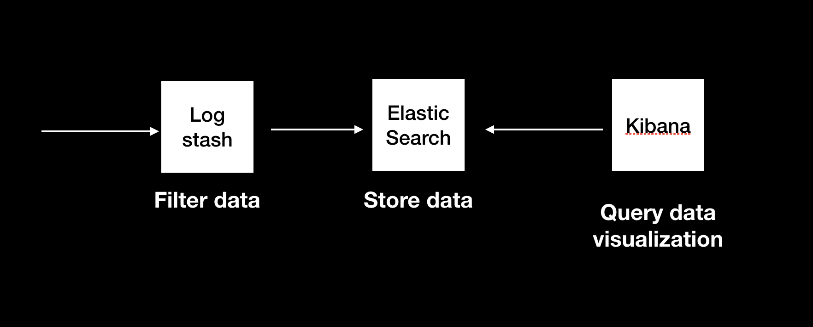

# elk-stack

- ## elastic search ( store data )
- ## log stash ( feed data to elastic search )
- ## kibana ( query data from elastic search and visualization data )

# how to run

- docker-compose up
- open kibana localhost:5601
